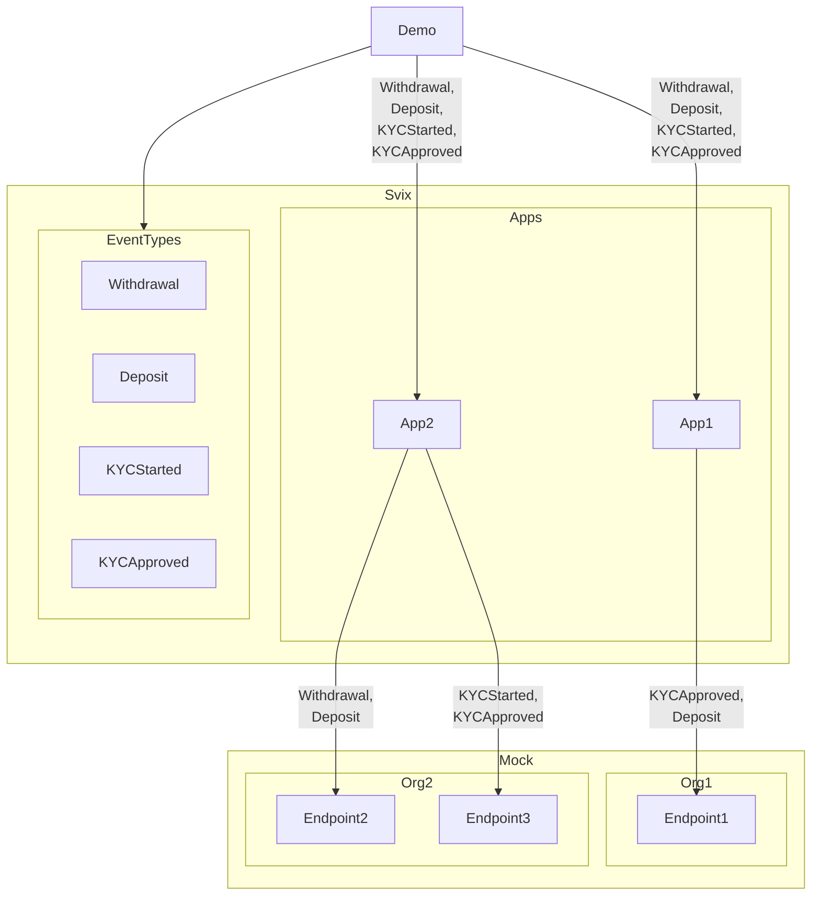

# SVIX POC
This repository contains example code to access svix


# High Level
The concept to prove is the decoupled management of message delivery and filtering of sent messages.



# WebHooks Config
This configuration is used by mocks to get the port to emulate, and by the demo to know which ports to register in svix.
 
```yaml
# .wh.yml
events:
  - name: Withdrawal
    schemas:
      1:  {
        opId: 'string',
        status: 'string'
      }
  - name: Deposit
    schemas: 
      1:  {
        opId: 'string',
        status: 'string'
      }
  - name: KYCStarted
    schemas: 
      1: {
        affiliateId: 'string'
      }
  - name: KYCApproved
    schemas: 
      1: {
        affiliateId: 'string'
      }
apps:
  - def:
      name: orgId1
    endpoints:
      - url: http://127.0.0.1:3428
        secret: 
          value: ...
          isSet: true
        filterTypes: 
        - KYCApproved
        - Deposit
  - def: 
      name: orgId2
    endpoints:
      - url: http://127.0.0.1:2574
        secret: 
          value: ...
          isSet: true
        filterTypes: 
        - Withdrawal
        - Deposit
      - url: http://127.0.0.1:3526
        secret: 
          value: ...
          isSet: true
        filterTypes: 
        - KYCStarted
        - KYCApproved
```

# Test
- Start Docker: `docker-compose up -d`
- Check token service logs to get auth token
- Run demo `go run . call demo -t {auth token}`
- Check logs for mock server

## Message Config
```yaml
# .msg.yml
orgId1:
  - eventType: Withdrawal
    payload: 
      opId: foo
      status: bar
  - eventType: Deposit
    payload: 
      opId: foo
      status: bar
  - eventType: KYCStarted
    payload: 
      affiliateId: asd
  - eventType: KYCApproved
    payload: 
      affiliateId: asd
orgId2:
  - eventType: Withdrawal
    payload: 
      opId: foo
      status: bar
  - eventType: Deposit
    payload: 
      opId: foo
      status: bar
  - eventType: KYCStarted
    payload: 
      affiliateId: asd
  - eventType: KYCApproved
    payload: 
      affiliateId: asd
```